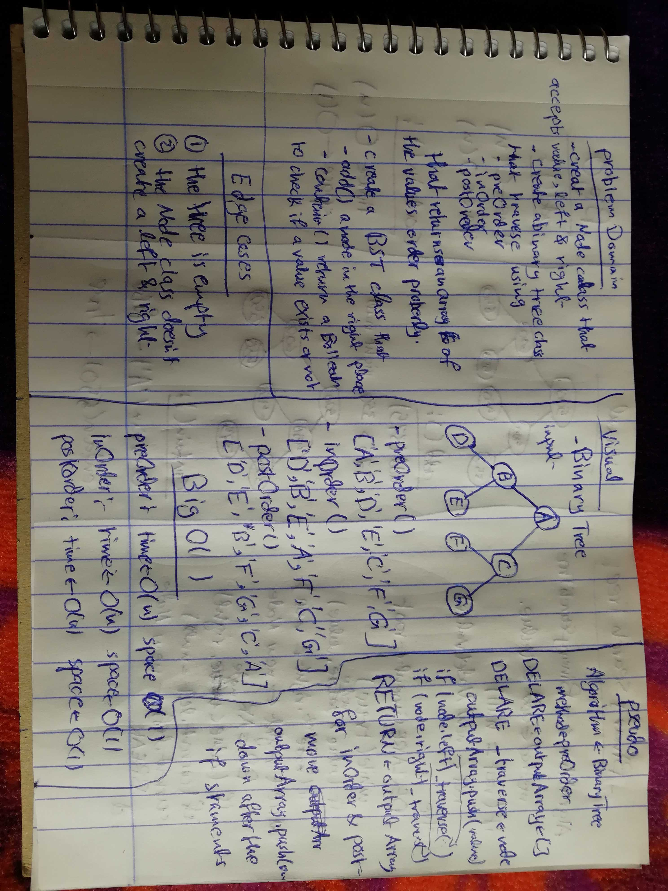
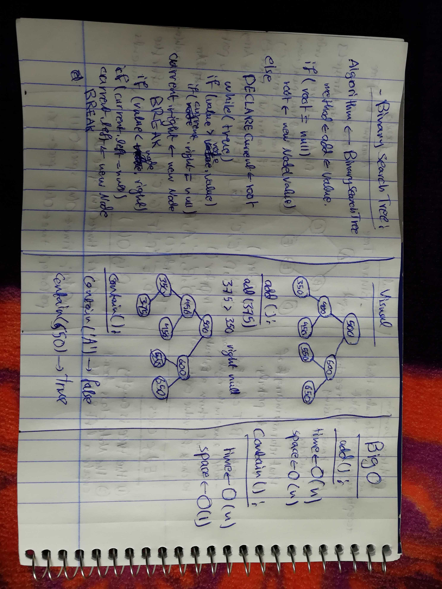

# Challenge 15

# Binary Tree and BST Implementation

# Challenge Summary
this challenge is about working with Binary trees, and Binary search trees, by creating a Node class that instantiate a new node with left and right, fot the child nodes, also work with Binary Search Trees.  

## Challenge Description
create a node class that instantiate a node with left and right, create methods that traverse through the Tree, using the depth first approach, the preOrder, inOrder, and postOrder methods are used. and for the binary search tree create a method that adds a node in the right place, and a method called contain that returns a Boolean if the value exists in the tree or not.

## Approach & Efficiency
in the binary tree traversing methods, the recursion method is used, by following the ordering of the traverse methods. and for the Binary search Tree, a lot of conditions and while loops are used. 

### Big O
  #### Binary Trees
   ##### preOrder()
    time O (n)
    space O (1)
    the time is O(n), because of recursion, and the space O(1), because no operations are done for the variables.
   
   ##### inOrder()
    time O (n)
    space O (1)
    the time is O(n), because of recursion, and the space O(1), because no operations are done for the variables.
    
   ##### postOrder()
    time O (n)
    space O (1)
    the time is O(n), because of recursion, and the space O(1), because no operations are done for the variables.

   #### Binary Search Tree
    ##### add()
     time O (n)
     space O (n)
     the time is O(n), because of the while loop, and the space is O(n), because of operations done to the current variable.

     ##### contain()
      time O (n)
      space O (1)
      the time is O(n), because of the while loop, and the space is O(1), because no variables are used just returning a Boolean. 

## Solution

