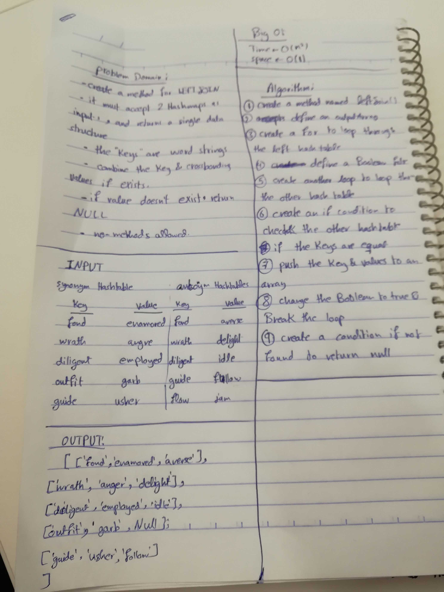

# Challenge 33

# Hash Map LEFT JOIN

# Challenge Summary
Joining two hashed tables is the challenge, by joining them in the LEFT JOIN logic, where it is built upon the SQL left Join.

## Challenge Description
Create a method named LeftJoin(), that joins two hashed tables using the left join logic, returning the key and both values, if the key is not present in the right hash table return null in it's place, no methods are allowed.

## Approach & Efficiency
The approach is using basic javascript, but the challenge can easily be solved by using the hashed table methods used earlier, both solutions are basically the same, with the same Big O. 

### Big O
 #### LeftJoin()
  time O (n^2)
  space O (1)
   Time is O(n^2), because of using nested loops, which will be the same solution if the contain method from the hashed table is used, and the space is the O(1), because no variable manipulations are done. 

## Solution
