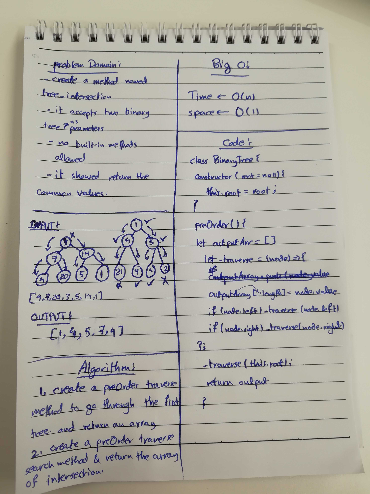

# Challenge 32

# Tree Intersection

# Challenge Summary
This challenge is about finding the nodes of intersections, between two binary trees. the binary trees can be either binary trees or binary search tree. 

## Challenge Description
Create a method that traverses accepts two binary trees as inputs, and returns an array of the intersection between the binary trees.

## Approach & Efficiency
No built-in methods are allowed in this challenge, the node class is used to instantiate nodes, the binary tree class with the preOrder method is used to traverse, and the created method to return the nodes of intersection. 

### Big O
time O (n)
space O (1)
Time is O(n) because of the for loop, we would need to iterate through the output arrays to find the values of intersection, and the space is O(1), because of not doing any variable modification.

## Solution

